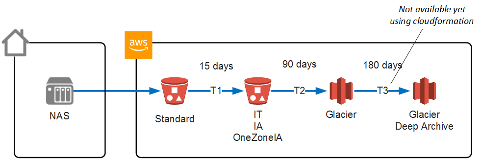

# AWS S3 backup

## Description

This project provides a CloudFormation template that creates a backup stack to AWS S3.

The stack allows seamless backup operations from a NAS (such as Synology) to AWS S3 with S3 Lifecycle management, security and logging.

The backup stack handles the following feature :

* S3 bucket for data backup
* Move object to other S3 tiers using Lifecycle
* Restrict access to a backup user using IAM
* Logging configuration of S3 access to another bucket


## Architecture overview



The principle is a follows:
  * The user works with files stored on the NAS.
  * The NAS copies data to the amazon S3 bucket

Once in S3 data can do the following :
  * Lifecycle Transitions:
    * T1: move to one of (IA, One Zone IA, Intelligent-Tiering ) after 15 days.
    * T2: move to Glacier after 90 days.
    * T3: Move to Glacier Deep Archive after 180 days.
  * Versionning (if enabled): creates new versions as files are modified or deleted. Old version are removed after 7 days.


## Use this stack

### Launch stack from this page

| AWS Region Code | Name | Launch |
| --- | --- | ---
| eu-west-3   | EU (Paris)   | [](https://console.aws.amazon.com/cloudformation/home?region=eu-west-3#/stacks/new?stackName=s3-backup-stack&templateURL=https://fbarmes-cfn-public.s3.eu-west-3.amazonaws.com/aws-s3-backup/master.yml)


### Launch from source

```bash

# clone this repositoy
git clone <url of this repository>

# generate this project's package
make

# install stack using aws-cli
aws-stack install
```

## FAQ

**Where does my data go  ?**

The data is copied by the NAS to a Data S3 bucket. The stack provides a single bucket for the whole backup

**How do I connect to the S3 bucket ?**

The stack creates a user and group dedicated for backup operation. the created user has API access to AWS.

**How are my data kept private in AWS ?**

This stack creates a set of resource dedicated to the backup.

The buckets are private and accessible by the backup user. The backup user only has access to the backup bucket.

**Can I apply different transition time for different file types ?**  
No. this feature is not supported. With S3 you can specify transition by file prefix, not by file type.


**Can I apply different lifecycle policies in the bucket ?**

The Lifecycle is applied to the bucket as a whole and at the root of the bucket.

There is no way to apply different Lifecycle policies according to different parts of the bucket or file types.

**What happens when I create a new file on the NAS ?**

The file is copied by the NAS backup agent and stored on amazon S3.

**What happens when I modify or rename a file on the NAS ?**

The new version of the file is copied by the NAS ackup agent to amazon S3. The new version

**What happens if I delete a file on the NAS ?**

Deletion is propagated by the NAS to the S3 bucket. The corresponding file is deleted in the bucket.

There is no deletion protection in the bucket.


## Features

### Encryption

**Encryption in transit**: Data is encrypted in transit using the standard HTTPS mechanism.

**Encryption at rest**: Data is encrypted at rest using server side encryption.


### Lifecycle

The data goes through the following transition Lifecycle :
* move to S3 Infrequent access (after 30 days by default)

In a subsequent version, the following additional transition will be supported:
* move to Glacier (after 180 days by default)
* move to Glacier Deep Archive (after 360 days by default)


### Automatic Deletion
There is no automatic deletion of data by the S3 bucket.


### Versionning
Versionning of files on amazon S3 is not yet implemented by this stack


### Cross Region Replication
Cross Region Replication is not implement by this stack.


## Build and Deploy

### Build and package this project

Build and deploy tasks are done using the following files:
 * `Makefile` : package and deploy CFN scripts
 * `aws-stack.sh`: create, update, delete the stack using CloudFormation


**`Makefile` targets**
 * `init`: init the package structure
 * `package`: make this project artifact
 * `publish`: deploy the cloudformation script to the CFN bucket
 * `clean`: delete the package structure
 * `clean-aws`: delete the script in the CFN bucket

**`aws-stack.sh` actions**
 * `aws-create`: deploy a new AWS stack from the CFN master template
 * `aws-update`: update the AWS stack
 * `aws-delete`: delete the AWS stack
